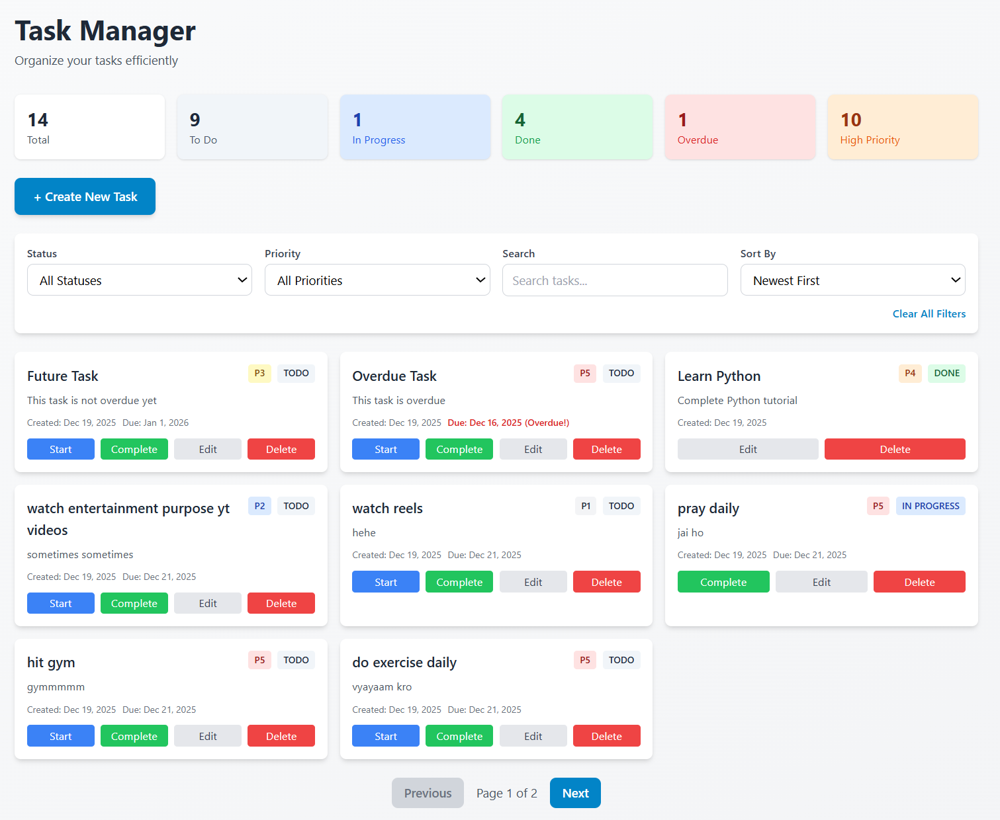

# Task Manager Service

A full-stack task management application built with Django REST Framework and React.



## 📋 Table of Contents

- [Features](#features)
- [Tech Stack](#tech-stack)
- [Project Structure](#project-structure)
- [Setup Instructions](#setup-instructions)
- [API Documentation](#api-documentation)
- [Testing](#testing)

## ✨ Features

- ✅ Complete CRUD operations for tasks
- ✅ Task filtering by status, priority, and date
- ✅ Search functionality
- ✅ Pagination support
- ✅ Task statistics dashboard
- ✅ Overdue task tracking
- ✅ Input validation
- ✅ Responsive UI with Tailwind CSS
- ✅ RESTful API with Swagger documentation
- ✅ Comprehensive unit tests

## 🛠 Tech Stack

**Backend:**
- Python 3.10
- Django 4.2
- Django REST Framework
- SQLite (development)
- pytest (testing)

**Frontend:**
- React 18
- Vite
- Tailwind CSS
- Axios

## 📁 Project Structure

```
task-manager/
├── backend/
│   ├── task_manager/          # Django project settings
│   ├── tasks/                 # Tasks app
│   │   ├── models.py          # Task model
│   │   ├── serializers.py     # API serializers
│   │   ├── views.py           # API views
│   │   ├── filters.py         # Filtering logic
│   │   └── tests/             # Test files
│   ├── manage.py
│   └── requirements.txt
├── frontend/
│   ├── src/
│   │   ├── components/        # React components
│   │   ├── services/          # API service
│   │   ├── App.jsx
│   │   └── main.jsx
│   ├── package.json
│   └── vite.config.js
└── README.md
```

## 🚀 Setup Instructions

### Prerequisites

- Python 3.10+
- Node.js 18+
- pip
- npm

### Backend Setup

1. **Navigate to backend directory:**
```bash
cd backend
```

2. **Create virtual environment:**
```bash
python -m venv venv
```

3. **Activate virtual environment:**

**Windows PowerShell:**
```powershell
& ".\venv\bin\Activate.ps1"
```

**Or run commands directly with the venv Python:**
```powershell
C:\Users\sahil\OneDrive\Desktop\tasker\backend\venv\bin\python.exe manage.py runserver
```

**Mac/Linux:**
```bash
source venv/bin/activate
```

4. **Install dependencies:**
```bash
pip install -r requirements.txt
```

5. **Run migrations:**
```bash
python manage.py migrate
```

6. **Create superuser (optional):**
```bash
python manage.py createsuperuser
```

7. **Run development server:**
```bash
python manage.py runserver
```

Backend will be available at: `http://localhost:8000`

### Frontend Setup

1. **Navigate to frontend directory:**
```bash
cd frontend
```

2. **Install dependencies:**
```bash
npm install
```

3. **Run development server:**
```bash
npm run dev
```

Frontend will be available at: `http://localhost:5173`

## 📚 API Documentation

### Base URL
```
http://localhost:8000/api/
```

### Interactive Documentation
- **Swagger UI:** `http://localhost:8000/swagger/`
- **ReDoc:** `http://localhost:8000/redoc/`

### Endpoints

#### List Tasks
```http
GET /api/tasks/
```

**Query Parameters:**
- `status` - Filter by status (todo, in_progress, done)
- `priority` - Filter by priority (1-5)
- `search` - Search in title and description
- `ordering` - Sort by field (created_at, priority, due_date)
- `page` - Page number for pagination

**Example:**
```bash
curl "http://localhost:8000/api/tasks/?status=todo&priority=5&page=1"
```

#### Create Task
```http
POST /api/tasks/
Content-Type: application/json

{
  "title": "Complete project",
  "description": "Finish the task manager",
  "status": "todo",
  "priority": 5,
  "due_date": "2024-12-31T23:59:59Z"
}
```

#### Get Single Task
```http
GET /api/tasks/{id}/
```

#### Update Task
```http
PUT /api/tasks/{id}/
Content-Type: application/json

{
  "title": "Updated title",
  "status": "done"
}
```

#### Partial Update
```http
PATCH /api/tasks/{id}/
Content-Type: application/json

{
  "status": "in_progress"
}
```

#### Delete Task
```http
DELETE /api/tasks/{id}/
```

#### Get Summary
```http
GET /api/tasks/summary/
```

Returns:
```json
{
  "total_tasks": 10,
  "todo_count": 3,
  "in_progress_count": 2,
  "done_count": 5,
  "overdue_count": 1,
  "high_priority_count": 4
}
```

#### Mark Task as Done
```http
POST /api/tasks/{id}/mark_done/
```

#### Mark Task as In Progress
```http
POST /api/tasks/{id}/mark_in_progress/
```

### Response Format

**Success Response:**
```json
{
  "id": "uuid",
  "title": "Task title",
  "description": "Task description",
  "status": "todo",
  "priority": 3,
  "due_date": "2024-12-31T23:59:59Z",
  "created_at": "2024-01-01T00:00:00Z",
  "updated_at": "2024-01-01T00:00:00Z",
  "is_overdue": false
}
```

**Error Response:**
```json
{
  "field_name": [
    "Error message"
  ]
}
```

## 🧪 Testing

### Run All Tests
```bash
cd backend
pytest
```

### Run Specific Test File
```bash
pytest tasks/tests/test_models.py
```

### Run Specific Test
```bash
pytest tasks/tests/test_models.py::TestTaskModel::test_create_task
```

### Run with Verbose Output
```bash
pytest -v
```

### Run with Coverage Report
```bash
pytest --cov=tasks --cov-report=term-missing
```

### Test Summary

The project includes **37 comprehensive tests** covering:

**Unit Tests (12 tests):**
- ✅ Model validation and behavior (2 tests)
- ✅ Serializer validation and data transformation (10 tests)
- ✅ Field validation (title, priority, status)
- ✅ Computed fields (is_overdue)
- ✅ Create and update operations
- ✅ Error handling

**Integration Tests (25 tests):**
- ✅ API Endpoints - List, Create, Retrieve, Update, Delete (8 tests)
- ✅ Filtering - By status, priority, search query (4 tests)
- ✅ Pagination - First page, second page, invalid page (3 tests)
- ✅ Custom Actions - mark_done, mark_in_progress, summary (3 tests)
- ✅ Computed Fields - is_overdue with various scenarios (3 tests)
- ✅ Error Responses - 404 handling, validation errors (4 tests)

**Test Files:**
- `tasks/tests/test_models.py` - Model tests
- `tasks/tests/test_serializers.py` - Serializer tests
- `tasks/tests/test_views.py` - API endpoint integration tests

##  Configuration

### CORS Settings

Backend is configured to accept requests from:
- `http://localhost:5173`
- `http://localhost:3000`

To add more origins, edit `backend/task_manager/settings.py`:
```python
CORS_ALLOWED_ORIGINS = [
    "http://localhost:5173",
    "http://your-frontend-url.com",
]
```

## 📊 API Examples with cURL

### Create a Task
```bash
curl -X POST http://localhost:8000/api/tasks/ \
  -H "Content-Type: application/json" \
  -d '{
    "title": "Learn Django",
    "description": "Complete Django REST tutorial",
    "priority": 4,
    "status": "in_progress"
  }'
```

### List All Tasks
```bash
curl http://localhost:8000/api/tasks/
```

### Filter Tasks
```bash
curl "http://localhost:8000/api/tasks/?status=todo&priority=5"
```

### Update Task
```bash
curl -X PATCH http://localhost:8000/api/tasks/{id}/ \
  -H "Content-Type: application/json" \
  -d '{"status": "done"}'
```

### Delete Task
```bash
curl -X DELETE http://localhost:8000/api/tasks/{id}/
```

## 🎯 Key Features Explained

### Filtering
Tasks can be filtered by:
- Status (todo, in_progress, done)
- Priority (1-5)
- Date ranges (created_at, due_date)
- Text search (title, description)

### Pagination
- Default page size: 8 items
- Navigate using `?page=2` parameter
- Response includes total count and next/previous links

### Validation
- Title: Required, minimum 3 characters
- Priority: Must be between 1-5
- Status: Must be one of: todo, in_progress, done
- Due date: Optional field

### Computed Fields
- `is_overdue`: Automatically calculated based on due_date and status
- `created_at`: Auto-set on creation
- `updated_at`: Auto-updated on modification

## 🐛 Troubleshooting

### Backend Issues

**Port 8000 already in use:**
```bash
python manage.py runserver 8001
```

**Migration errors:**
```bash
python manage.py makemigrations
python manage.py migrate
```

**Database reset:**
```bash
rm db.sqlite3
python manage.py migrate
```

### Frontend Issues

**Port 5173 already in use:**
Edit `vite.config.js` and change the port:
```javascript
server: {
  port: 3000
}
```

**CORS errors:**
Make sure backend is running and CORS settings include your frontend URL.

**Build errors:**
```bash
rm -rf node_modules package-lock.json
npm install
```

## 📝 License

MIT License - feel free to use this project for learning and development.

## 👨‍💻 Author

Created as part of a technical assessment for backend development position.

## 🙏 Acknowledgments

- Django REST Framework documentation
- React documentation
- Tailwind CSS

---

For questions or issues, please create an issue in the repository.